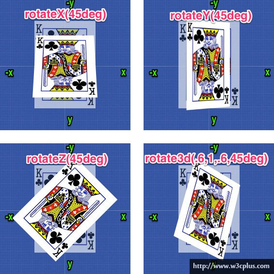

3D 转换
====

CSS3 3D Transform,用于 3 维动画或旋转。

CSS3 3D 转换是一个属性,用于改变元素的实际形式。这个特性可以改变元素的形状、大小和位置。

主要有下列方法：

* rotateX()
* rotateY()
* rotateZ()

**注意：**Internet Explorer 10 和 Firefox 支持 3D 转换；
Chrome 和 Safari 必须添加前缀 -webkit-；
Opera 还不支持 3D 转换(支持 2D 转换 )

## rotateX()

rotateX()方法，围绕其在一个给定度数X轴旋转的元素。

	.rotate-x {
	    transform: rotateX(60deg);
	    -webkit-transform: rotateX(120deg); /* Safari and Chrome */
	}

## rotateY()
 
rotateY()方法，围绕其在一个给定度数Y轴旋转的元素。

    .rotate-y {
        transform: rotateY(60deg);
        -webkit-transform: rotateY(120deg); /* Safari and Chrome */
    }

## rotateZ()
 
rotateZ()方法，围绕其在一个给定度数Z轴旋转的元素。

    .rotate-z {
        transform: rotateZ(60deg);
        -webkit-transform: rotateY(120deg); /* Safari and Chrome */
    }

## rotate3d()
otate3d(x,y,z,a)中取值说明：

* x：是一个0到１之间的数值，主要用来描述元素围绕X轴旋转的矢量值；
* y：是一个０到１之间的数值，主要用来描述元素围绕Y轴旋转的矢量值；
* z：是一个０到１之间的数值，主要用来描述元素围绕Z轴旋转的矢量值；
* a：是一个角度值，主要用来指定元素在3D空间旋转的角度，如果其值为正值，元素顺时针旋转，反之元素逆时针旋转。
面介绍的三个旋转函数功能等同：

* rotateX(a)函数功能等同于rotate3d(1,0,0,a)
* rotateY(a)函数功能等同于rotate3d(0,1,0,a)
* rotateZ(a)函数功能等同于rotate3d(0,0,1,a)

例子

    .rotate-3d {
        transform: rotate3d(0,0.6,0.2,60deg);
        -webkit-transform: rotate3d(0.6,0.6,0.2,60deg); /* Safari and Chrome */
    }

## 转换方法

<table class="reference"> <tbody><tr> <th style="width:25%;">函数</th> <th>描述</th> </tr> <tr> <td>matrix3d(<i>n</i>,<i>n</i>,<i>n</i>,<i>n</i>,<i>n</i>,<i>n</i>, <i>n</i>,<i>n</i>,<i>n</i>,<i>n</i>,<i>n</i>,<i>n</i>,<i>n</i>,<i>n</i>,<i>n</i>,<i>n</i>)</td> <td>定义 3D 转换，使用 16 个值的 4x4 矩阵。</td> </tr> <tr> <td>translate3d(<i>x</i>,<i>y</i>,<i>z</i>)</td> <td>定义 3D 转化。</td> </tr> <tr> <td>translateX(<i>x</i>)</td> <td>定义 3D 转化，仅使用用于 X 轴的值。</td> </tr> <tr> <td>translateY(<i>y</i>)</td> <td>定义 3D 转化，仅使用用于 Y 轴的值。</td> </tr> <tr> <td>translateZ(<i>z</i>)</td> <td>定义 3D 转化，仅使用用于 Z 轴的值。</td> </tr> <tr> <td>scale3d(<i>x</i>,<i>y</i>,<i>z</i>)</td> <td>定义 3D 缩放转换。</td> </tr> <tr> <td>scaleX(<i>x</i>)</td> <td>定义 3D 缩放转换，通过给定一个 X 轴的值。</td> </tr> <tr> <td>scaleY(<i>y</i>)</td> <td>定义 3D 缩放转换，通过给定一个 Y 轴的值。</td> </tr> <tr> <td>scaleZ(<i>z</i>)</td> <td>定义 3D 缩放转换，通过给定一个 Z 轴的值。</td> </tr> <tr> <td>rotate3d(<i>x</i>,<i>y</i>,<i>z</i>,<i>angle</i>)</td> <td>定义 3D 旋转。</td> </tr> <tr> <td>rotateX(<i>angle</i>)</td> <td>定义沿 X 轴的 3D 旋转。</td> </tr> <tr> <td>rotateY(<i>angle</i>)</td> <td>定义沿 Y 轴的 3D 旋转。</td> </tr> <tr> <td>rotateZ(<i>angle</i>)</td> <td>定义沿 Z 轴的 3D 旋转。</td> </tr> <tr> <td>perspective(<i>n</i>)</td> <td>定义 3D 转换元素的透视视图。</td> </tr> </tbody></table>

## 源码

本文中所用例子源码参见
<https://github.com/waylau/css3-tutorial> 中 `samples` 目录下的 3d_transform.html

## 参考
* <http://www.zhangxinxu.com/wordpress/2012/09/css3-3d-transform-perspective-animate-transition/>
* <http://www.w3cplus.com/css3/css3-3d-transform.html>