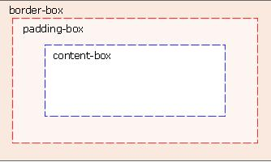

背景
====

CSS3 Background 中包含几个新的背景属性，提供更大背景元素控制。

主要是2个背景属性：

* background-size
* background-origin

您还将学习如何使用多重背景图像。

## background-size 

该属性规定背景图片的尺寸。

在 CSS3 之前，背景图片的尺寸是由图片的实际尺寸决定的。在 CSS3 中，可以规定背景图片的尺寸，这就允许我们在不同的环境中重复使用背景图片。

您能够以像素或百分比规定尺寸。如果以百分比规定尺寸，那么尺寸相对于父元素的宽度和高度。

	.background-size {
	    background: url(images/wl_white.png);
	    background-size: 100px 40px;
	    -moz-background-size: 100px 40px; /* Firefox 3.6 */
	    -webkit-background-size: 100px 40px;
	    background-repeat: no-repeat;
	    padding-top: 40px;
	}

## background-origin

该属性指定了背景图像的位置区域。

content-box, padding-box,和 border-box 区域内可以放置背景图像。

    .background-origin-border {
        width: 250px;
        height: 250px;
        border: 1px dotted green;
        padding: 25px;
        background-image: url('images/border.png');
        background-repeat: no-repeat;
        background-position: left;
        background-origin: border-box;
    }

    .background-origin-content {
        width: 250px;
        height: 250px;
        border: 1px dotted green;
        padding: 25px;
        background-image: url('images/border.png');
        background-repeat: no-repeat;
        background-position: left;
        background-origin: content-box;
    }

## 源码

本文中所用例子源码参见
<https://github.com/waylau/css3-tutorial> 中 `samples` 目录下的 background_size.html、background_origin.html