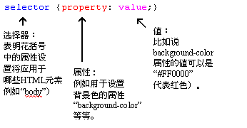
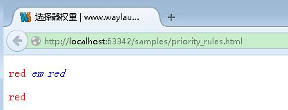
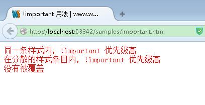

介绍
====

## 什么是CSS
CSS 是 Cascading Style Sheet（层叠样式表）的缩写。是用于（增强）控制网页样式并允许将样式信息与网页内容分离的一种标记性语言。CSS 不需要编译,可以直接由浏览器执行(属于浏览器解释型语言)。

### 历史
* CSS 最早被提议是在1994年；
* 最早被浏览器支持是1996年；
* 1996年 W3C 正式推出了CSS1；
* 1998年 W3C 正式推出了CSS2；
* CSS2.1 是 W3C 现在正在推荐使用的；
* CSS3 现在还处于开发中；
* CSS 3 在包含了所有 CSS 2 所支持的基础上更有所改进，所以不必担心兼容问题。

CSS 支持多种设备，例如手机、电视、打印机、幻灯片等。但是 CSS 在浏览器上得到了更好的推广。

## 语法

selector {property: value;}

## 引入方式

三种方式将样式表加入您的网页：

### 内联方式 Inline Styles

内联定义即是在对象的标记内使用对象的 style 属性定义适用其的样式表属性。
示例代码：

	
这一行的字体颜色将显示为红色

### 内部样式块对象 Embedding a Style Block

你可以在你的 HTML 文档的`<head>`标记里插入一个`

### 外部样式表 Linking to a Style Sheet

你可以先建立外部样式表文件`*.css`，然后使用 HTML 的 link 对象。或者使用 `@import` 来引入。
示例代码：

	<!-- Use link elements -->
	<link rel="stylesheet" href="core.css">
	
	<!-- Use @imports -->
	

**注意**：在实际开发中，推荐使用 HTML 的 link 对象来引入。详细内容可以参见<http://www.waylau.com/css-code-guide/#css-miscellaneous>

## 选择器权重

权重主要分为 4 个等级：

* 第一等：代表内联样式，如: `style=""`，权值为1000
* 第二等：代表ID选择器，如：`#content`，权值为100
* 第三等：代表类，伪类和属性选择器，如`.content`，权值为10
* 第四等：代表类型选择器和伪元素选择器，如`div p`，权值为1

例子如下

	<!DOCTYPE html>
	<html>
	<head>
	    <meta charset="utf-8">
	    <title>选择器权重 | www.waylau.com</title>
	    <meta name="description" content="选择器权重">
	    <meta name="author" content="Way Lau, www.waylau.com"/>
	    <meta name="viewport" content="width=device-width">
	    <link rel="shortcut icon" href="/favicon.ico">
	
	    
	</head>
	<body>
	

	    
red
	        <em>em red</em>
	    

	
	    
red

	

	</body>
	</html>

最终页面效果如下：

## 优先级

遵循如下法则：

* 选择器都有一个权值，权值越大越优先；
* 当权值相等时，后出现的样式表设置要优于先出现的样式表设置；
* 创作者的规则高于浏览者：即网页编写者设置的 CSS 样式的优先权高于浏览器所设置的样式；
* 继承的 CSS 样式不如后来指定的 CSS 样式；
* 在同一组属性设置中标有`!important`规则的优先级最大 

例子如下：

	<!DOCTYPE html>
	<html>
	<head>
	    <meta charset="utf-8">
	    <title>!important 用法 | www.waylau.com</title>
	    <meta name="description" content="!important 用法">
	    <meta name="author" content="Way Lau, www.waylau.com"/>
	    <meta name="viewport" content="width=device-width">
	    <link rel="shortcut icon" href="/favicon.ico">
	
	    
	</head>
	<body>
	
同一条样式内，!important 优先级高

	
在分散的样式条目内，!important 优先级高

	
没有被覆盖

	</body>
	</html>

## 源码

本文中所用例子源码参见
<https://github.com/waylau/css3-tutorial> 中 `samples` 目录下的 important.html、priority_rules.html

## 参考
* <http://www.nowamagic.net/csszone/css_SeletorPriorityRules.php>
* <http://www.cnblogs.com/xugang/archive/2010/09/24/1833760.html>